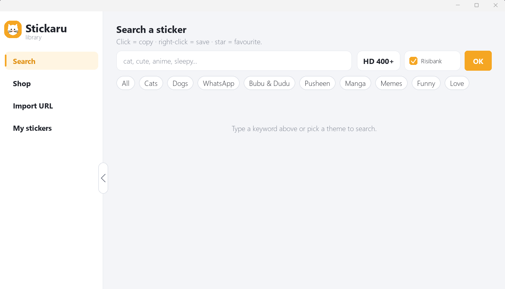

<div align="center">

# 🐱 Stickaru

### Ta bibliothèque de stickers et de mèmes pour Windows — cherche, clique, colle.

[English](README.md) · **Français**


</div>

<p align="center"></p>

---

## 📥 Télécharger

Va dans l'onglet **[Releases](../../releases/latest)** et télécharge :

- **`Stickaru-Setup.exe`** : installateur (installe dans ton profil, crée les raccourcis du menu Démarrer et du Bureau, aucun droit administrateur nécessaire) ;
- **`Stickaru.exe`** : version portable, à lancer directement.

> Windows peut afficher « SmartScreen a protégé votre ordinateur » : les exécutables ne sont pas signés. Clique sur *Informations complémentaires → Exécuter quand même*.

## ✨ Fonctions

| | |
|---|---|
| 🔎 **Recherche** | Stickers animés (Tenor, GIPHY), packs Telegram (annuaire public combot.org) et RisiBank — **sans clé API, sans inscription**. |
| 📋 **Un clic = copié** | Clique sur une image : elle est copiée dans le presse-papiers (avec transparence), prête à coller dans WhatsApp, Discord, WeChat… |
| 💾 **Mes stickers** | Clic droit pour enregistrer dans ta collection locale, ⭐ pour mettre en favori. |
| 🔗 **Import par URL** | Colle l'adresse d'un sticker, d'un GIF ou d'un pack pour l'ajouter. |
| 🌍 **Interface multilingue** | Français, anglais et chinois (`langue.py`). |
| 🖥️ **Rendu net** | Prise en charge du DPI par écran (Windows 10/11), thème clair. |
| 🐈 **Chat volant** | Un petit widget de bureau transparent, toujours au premier plan, qui fait défiler tes stickers. |

## 🐈 Le Chat volant (`chat_volant.py`)

| Commande | Action |
|---|---|
| Glisser | déplacer le chat |
| Clic gauche / droit | sticker suivant / précédent |
| Molette | changer de sticker |
| `B` ou bouton **+** | ouvrir la bibliothèque en ligne |
| `R` | recharger les stickers du dossier |
| Double-clic, `Échap`, `Q` | quitter |

Dépose tes propres PNG (fond transparent) dans le dossier `stickers/`.

## 🚀 Installation

```bash
pip install -r requirements.txt
python bibliotheque.py     # la bibliothèque
python chat_volant.py      # le widget de bureau
```

### Créer un exécutable (exemple)

```bash
pip install pyinstaller
pyinstaller --noconsole --onefile --icon chat.ico --name Stickaru bibliotheque.py
```

`lancer.bat` démarre ensuite `Stickaru.exe`.

## 🗂️ Structure

```
bibliotheque.py   interface principale (recherche, presse-papiers, favoris)
packs_index.json  index de packs Telegram conseillés
sources.py        sources en accès libre (Tenor, GIPHY, Telegram/combot, RisiBank, URL)
langue.py         traductions de l'interface (fr / en / zh)
chat_volant.py    widget de bureau
installer/        sources de l'installateur Windows (Python + PyInstaller)
docs/capture.png  capture d'écran
```

Les dossiers `stickers/`, `memes/` et les caches ne sont pas dans le dépôt : ils sont créés et remplis à l'usage.

## ⚠️ À savoir

Les stickers appartiennent à leurs auteurs. Stickaru ne fait que rechercher des contenus publics et les copier pour un usage personnel ; respecte les conditions d'utilisation des sites interrogés.

<div align="center">

*Fait avec 🐱 et pygame.*

</div>
